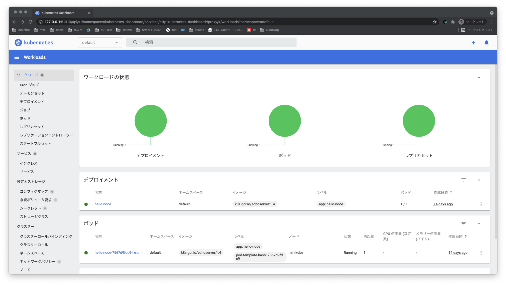
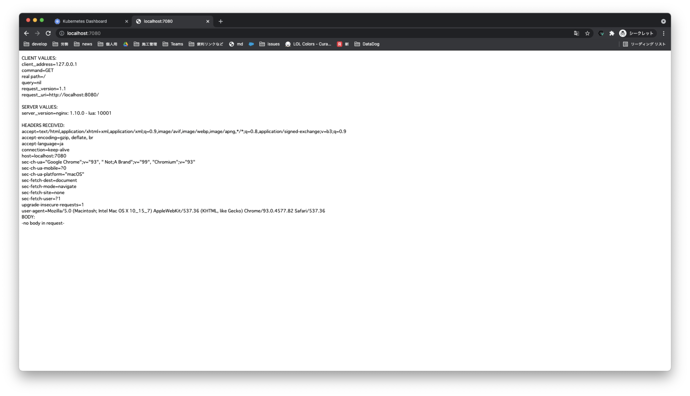

## minikube start

### Start your cluster

```
$ minikube start

😄  Darwin 11.4 上の minikube v1.23.1
✨  プロフィールを元に、 docker ドライバを使用します
👍  コントロールプレーンのノード minikube を minikube 上で起動しています
🚜  イメージを Pull しています...
💾  Kubernetes v1.22.1 のダウンロードの準備をしています
    > preloaded-images-k8s-v13-v1...: 511.84 MiB / 511.84 MiB  100.00% 19.25 Mi
🔄  既存の docker container を "minikube" のために再起動しています...
🐳  Docker 20.10.8 で Kubernetes v1.22.1 を準備しています...
🔎  Kubernetes コンポーネントを検証しています...
    ▪ イメージ gcr.io/k8s-minikube/storage-provisioner:v5 を使用しています
    ▪ イメージ kubernetesui/dashboard:v2.3.1 を使用しています
    ▪ イメージ kubernetesui/metrics-scraper:v1.0.7 を使用しています
🌟  有効なアドオン: storage-provisioner, dashboard, default-storageclass
🏄  完了しました！ kubectl が「"minikube"」クラスタと「"default"」ネームスペースを使用するよう構成されました
```

### Interact with your cluster

```
$ kubectl get po -A

default                hello-node-7567d9fdc9-fxrdm                  1/1     Running   1 (3m1s ago)   14d
kube-system            coredns-78fcd69978-vldt8                     1/1     Running   2 (3m1s ago)   14d
kube-system            etcd-minikube                                1/1     Running   2 (3m1s ago)   14d
kube-system            kube-apiserver-minikube                      1/1     Running   2 (3m1s ago)   14d
kube-system            kube-controller-manager-minikube             1/1     Running   2 (3m1s ago)   14d
kube-system            kube-proxy-p7bh9                             1/1     Running   2 (3m1s ago)   14d
kube-system            kube-scheduler-minikube                      1/1     Running   2 (3m1s ago)   14d
kube-system            storage-provisioner                          1/1     Running   6 (3m1s ago)   14d
kubernetes-dashboard   dashboard-metrics-scraper-5594458c94-rct2g   1/1     Running   0              2m10s
kubernetes-dashboard   kubernetes-dashboard-654cf69797-l5fzk        1/1     Running   0              2m10s
```

Dashboardがバンドルされてるので確認する。(ダッシュボードをWebで確認できるようにするもの)

```
$ minikube dashboard

🤔  ダッシュボードの状態を確認しています...
🚀  プロキシを起動しています...
🤔  プロキシの状態を確認しています...
🎉  Opening http://127.0.0.1:51310/api/v1/namespaces/kubernetes-dashboard/services/http:kubernetes-dashboard:/proxy/ in your default browser...
```



### Deploy applications

```
# サンプルを作成
$ kubectl create deployment hello-minikube --image=k8s.gcr.io/echoserver:1.4

deployment.apps/hello-minikube created

# port 8080 を割り当てて公開
$ kubectl expose deployment hello-minikube --type=NodePort --port=8080

service/hello-minikube exposed
```

```
# サービスの状態を確認
$ minikube service hello-minikube

NAME             TYPE       CLUSTER-IP      EXTERNAL-IP   PORT(S)          AGE
hello-minikube   NodePort   10.108.24.129   <none>        8080:30946/TCP   22s
```

```
# ポートフォワーディングさせてローカルで確認できる状態にする
$ kubectl port-forward service/hello-minikube 7080:8080

Forwarding from 127.0.0.1:7080 -> 8080
Forwarding from [::1]:7080 -> 8080
```



### LoadBalancer deployments

```
# ロードバランサーを作成
$ kubectl create deployment balanced --image=k8s.gcr.io/echoserver:1.4

deployment.apps/balanced created

# ロードバランサーのportを割り当てる
$ kubectl expose deployment balanced --type=LoadBalancer --port=8080

service/balanced exposed
```

別タブでロードバランサーにIPを割り当てる

```
$ minikube tunnel
🏃  Starting tunnel for service balanced.
🏃  Starting tunnel for service hello-node.
```

割り当てられたロードバランサーを確認する

```
$ kubectl get services balanced

NAME       TYPE           CLUSTER-IP      EXTERNAL-IP   PORT(S)          AGE
balanced   LoadBalancer   10.109.231.56   127.0.0.1     8080:31650/TCP   2m14s
```

### Manage your cluster

- デプロイされたアプリケーションに影響を与えずにKubernetesを一時停止する

```
$ minikube pause
```

- 一時停止したインスタンスの一時停止を解除する

```
$ minikube unpause
```

- クラスターを停止

```
minikube stop
```

- デフォルトのメモリ制限を増やす（再起動が必要）

```
minikube config set memory 16384
```

- 簡単にインストールできるKubernetesサービスのカタログを参照

```
$ minikube addons list
```

- 古いKubernetesリリースを実行する2番目のクラスターを作成する

```
minikube start -p aged --kubernetes-version=v1.16.1
```

- すべてのminikubeクラスターを削除する

```
$ minikube delete --all
```
